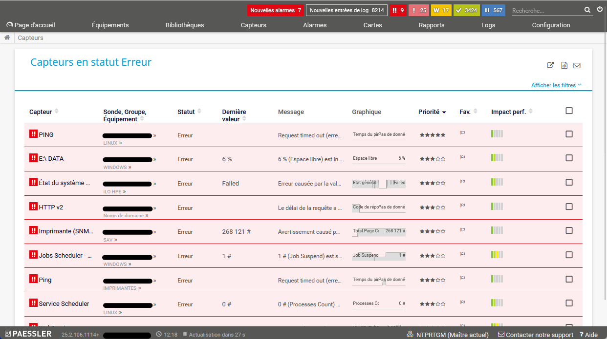
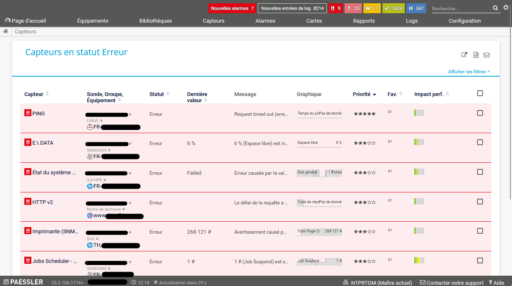

    

  
  

 

<h1 align="center">PRTG Designer</h1>

  <strong>Extension navigateur pour corriger l'affichage des noms de serveur dans PRTG</strong>

  <a href="#description">Description</a> •
  <a href="#installation">Installation</a> •
  <a href="#démo">Démo</a> •
  <a href="#support">Support</a>

  

## Description

**PRTG Designer** est une extension navigateur qui résout temporairement un problème d'affichage dans PRTG Network Monitor où les noms de serveur sont masqués par des éléments graphiques.
Elle sert de solution provisoire en attendant que les développeurs de chez Paessler corrigent définitivement ce bug.

## Installation

### Installation automatique (recommandée)

- 🦊 **Firefox :** Installez directement depuis le [Mozilla Add-ons Store](https://addons.mozilla.org/fr/firefox/addon/prgt-designer)

- 🌐 **Chrome** (bientôt disponible)

### Installation manuelle

1. **Téléchargez** la dernière version depuis les [releases GitHub](https://github.com/Game-K-Hack/prtg-designer/releases/latest)

2. **Installation dans le navigateur :**

    - 🦊 **Firefox :**
      - Ouvrez Firefox et accédez à `about:addons`
      - Cliquez sur l'icône ⚙️ (paramètres) en haut à droite
      - Sélectionnez "**Installer un module depuis un fichier...**"
      - Choisissez le fichier `.xpi` téléchargé

    - 🌐 **Chrome :**
      - *Prochainement disponible*

## Démo

#### Sans l'extension

#### Avec l'extension

## Support

Si vous rencontrez des problèmes, veuillez [ouvrir une issue](https://github.com/Game-K-Hack/prtg-designer/issues) sur GitHub.
